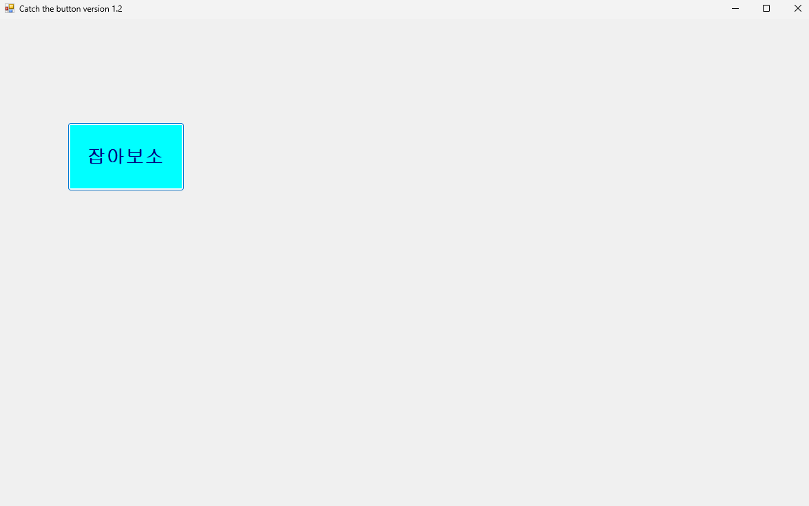
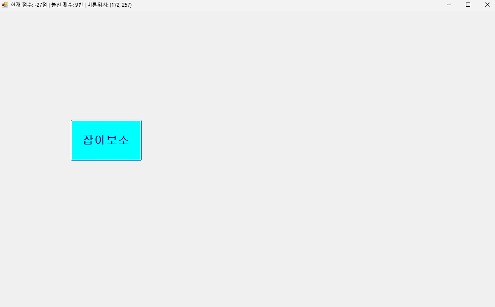
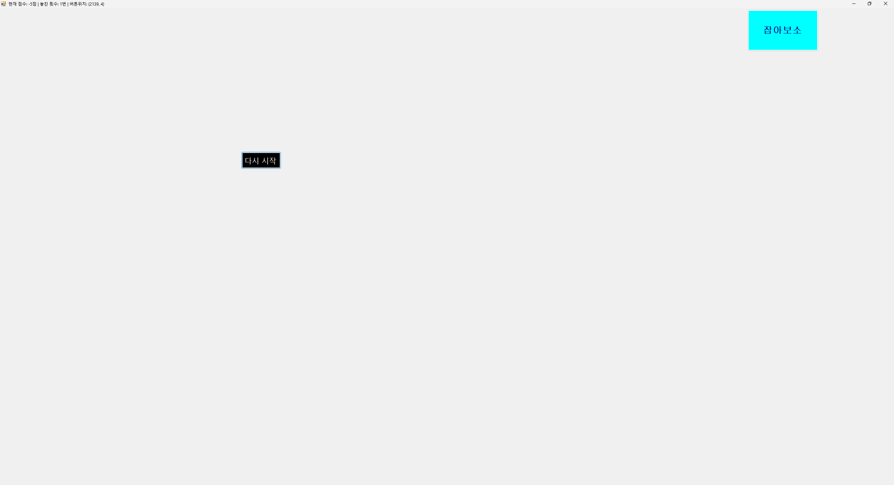
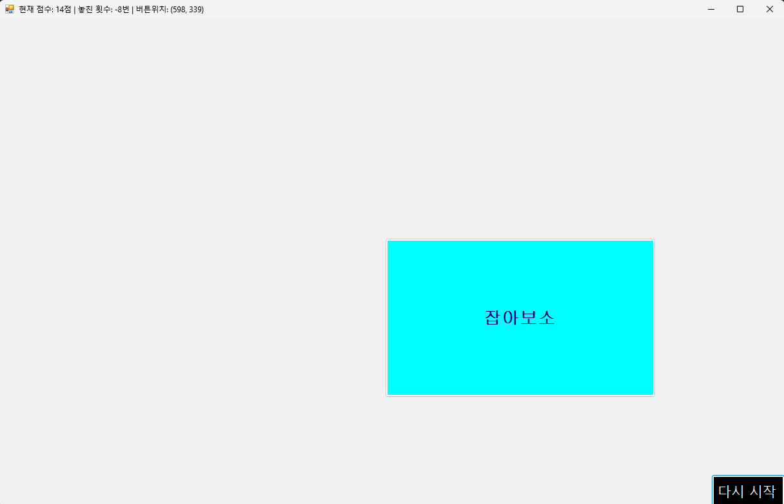
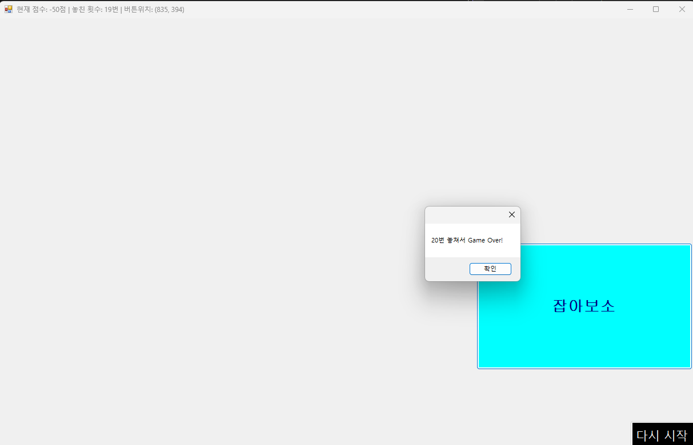

2주차_1 속성과 이벤트
23017096 최인성

핵심: Form과 버튼의 이름 수정, 이벤트 작성(난수 생성, 가용 용역 제한, 버튼 랜덤 좌표, 위치할당, 시각적 피드백)

교수님 강의 들으면서 보고 따라하는 과정이고, 1주차때는 정정기간으로 강의를 못 들어서 1주차 과제를 할 때 이것저것 보면서 따라하고 AI의 도움을 받았다보니까
오늘 진행하는 부분과 1주차 과제와 일부 비슷한 부분들이 있어서 오늘 강의를 따라가는 것에 있어서는 전보다 수월했음.

하지만 Git을 커밋하고 코파일럿으로 핵심 내용을 검토하다가 수정하면 좋을 권장 사항들을 확인했고 이를 진행하고 다음 커밋을 진행할 계획. 
(사진을 기록하기 전에 readme를 작성하먀 코파일럿을 돌려서 코드 수정이 이미 진행되어버려서 다음 코밋부터 사진 기록을 할 예정)

----------------------------------------------------------------------------------------------------------------------------------------------------------------------------------------------------------------

<오류가 발생하여 이전 리포지토리는 _ErrorHistory로 바꾸고, 이전에 커밋했던 파일로 복구하여 새로 만든 리포지토리>

코파일럿의 권장 사항들로 적용을 하다가 파일 이름도 코파일럿으로 수정하다가, 너무 많은 것들이 바뀌면서 파일이 꼬여버린거 같음.
그래서 이 또한 코파일럿으로 해결이 될까싶어 코파일럿에게 파일을 이전으로 되돌리고싶다고 하고 그대로 따라 진행했는데 점차 잘못됨을 느낌.
계속해서 시도하다가 이건 아니다싶어서 기존 꼬인 파일을 커밋하고 지워버림. 그리고 GitHub에서 코파일럿을 사용하기 이전의 커밋했던 파일을 다운 받아 복구함.

  -> 이러한 시행착오를 통해 교수님께서 파일명 수정법과 커밋하는 습관, ReadMe, 주석을 누차 강조하시는 이유를 몸소 깨닳게 되었음. 
     또한 이 과정에서 많은 시간(강의 1시간 반 이상)을 소비하며 문제해결을 하고자하는 자세는 좋았지만, 해결하지 못할 때는 과감히 포기하고 차안(커밋 활용 복구)을 몰색하여 수습할 용기와 판단 또한 중요하다는 것을 깨닳음. 
     

----------------------------------------------------------------------------------------------------------------------------------------------------------------------------------------------------------------

<２단계－시각적／청각적　피드백　성공. ３단계하기전에　ＭｏｕｓｅＤｏｗｎ／Ｕｐ　도전>
깃허브와 구글에서 Click 개념을 찾아가며 진행했습니다. 제미나이pro가 copilot보다 성능이 좋은 것 같아서 검토 및 오류 해결, 원인 분석용으로 활용하고 있습니다. Click으로는 성공했으니 이제 교수님께서 말씀하신 Mouse Down/Up으로 시도할 계획입니다.

마우스 포인터까지 넣었는데 메시지 창 때문에 up이 적용안되는걸 확인함. 
그래서 this.Cursor = Cursors.Default;를 써서 해결하고자함.

----------------------------------------------------------------------------------------------------------------------------------------------------------------------------------------------------------------

<3단계 + 4단계> 
커밋만 하고 ReadMe작성을 까먹었습니다. 그리고  사진도 올리지 않았다는걸 뒤늦게 눈치챘습니다. 
3단계와 4단계를 하며 떠오르는 기믹들을 나름 추가해봤습니다. 
(좌/우클릭의 점수와 크기, 놓친 횟수차감 그리고 우클릭은 횟수 제한으로 차별화 등)

창의 크기에 따라 버튼의 위치가 달라서 이 부분과 밸런스 부분을 다음에 수정해보겠습니다.

.png)
.png)

----------------------------------------------------------------------------------------------------------------------------------------------------------------------------------------------------------------

다시 시작 버튼이 창 크기에 따라 위치가 바뀌지않는 것을 확인하고 Anchor로 우측 하단으로 위치를 고정했습니다. 
그리고 꼼수 방지를 위해 최소창 크기 제한도 설정했습니다.
파일명 또한 파일탐색기를 비롯해 다른 곳에서 변경하지않고 솔루션 탐색기에서 정성적으로 변경했습니다.

사진이 복붙과 하단에 있는 Attach files by dragging~~ 모두 안되어서 파일을 함께 올립니다.
-> 시크릿모드(기본캐시), 엣지, 하드웨어가속 on/off, 팝업 및 클립보드 허용 등 모두 시도해봤지만 해결이 안되어서
   해결될 때까진 번거롭지만 커밋하기 전에 프로젝트 파일에 사진을 넣어 함께 커밋하겠습니다. 
   (제미나이pro등을 통해 해결하고자했으나 잘 안되었습니다)
   

